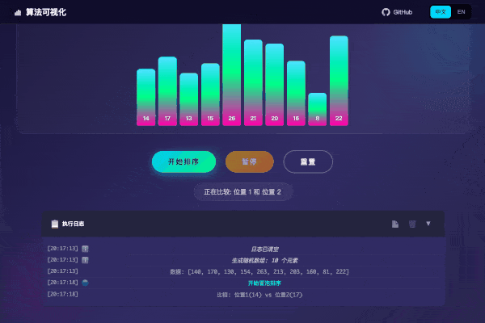

# Animated Algorithm Guide | 算法可视化学习平台

[](https://opensource.org/licenses/MIT)
[](https://algo.jsdiff.com)

Welcome to the Algorithm Visualization Learning Platform! This platform helps you deeply understand algorithm principles through interactive animations.

欢迎来到算法可视化学习平台！通过交互式动画深入理解经典算法的工作原理。

🌐 **Live Demo / 在线演示**: [algo.jsdiff.com](https://algo.jsdiff.com)

<div align="center">
  
  <p><em>Interactive algorithm visualization with smooth animations | 流畅动画的交互式算法可视化</em></p>
</div>

## Features | 特性

- 🎬 **Smooth Animations** - Carefully designed CSS animations for clear visualization
- 🎮 **Interactive Controls** - Pause, reset, and customize input data
- 📚 **Detailed Explanations** - Principles, complexity analysis, and real-world applications
- 📋 **Execution Logging** - Real-time step-by-step execution logs with copy and export features
- 🌍 **Internationalization** - Full support for Chinese and English (static generation)
- 📱 **Responsive Design** - Works on desktop and mobile devices
- 🚀 **Zero Dependencies** - Pure HTML/CSS/JavaScript, no frameworks required
- 🌙 **Dark Mode** - Eye-friendly dark theme design

## Platform Comparison | 平台对比

Wondering how we compare to other algorithm visualization platforms? Check out our detailed comparison:

想知道我们与其他算法可视化平台有什么区别？查看我们的详细对比评测：

📊 **[Comparison Review | 对比评测](https://algo.jsdiff.com/docs/comparison/)**

| Platform | Visual Design | UX | Chinese Support |
|----------|--------------|-----|-----------------|
| **algo.jsdiff.com** | ⭐⭐⭐⭐⭐ | ⭐⭐⭐⭐⭐ | ⭐⭐⭐⭐⭐ |
| VisuAlgo | ⭐⭐⭐⭐ | ⭐⭐⭐ | ⭐⭐⭐ |
| USFCA | ⭐⭐ | ⭐⭐⭐ | ❌ |
| Toptal | ⭐⭐⭐ | ⭐⭐⭐ | ❌ |

Detailed comparisons:
- [algo.jsdiff.com vs VisuAlgo](https://algo.jsdiff.com/docs/comparison/vs-visualgo.html)
- [algo.jsdiff.com vs USFCA](https://algo.jsdiff.com/docs/comparison/vs-usfca.html)
- [algo.jsdiff.com vs Toptal](https://algo.jsdiff.com/docs/comparison/vs-toptal.html)

## Algorithms | 算法列表

### Sorting Algorithms | 排序算法 (4)
- **Bubble Sort** | 冒泡排序 - O(n²)
- **Heap Sort** | 堆排序 - O(n log n)
- **Quick Sort** | 快速排序 - O(n log n)
- **Merge Sort** | 归并排序 - O(n log n)

### String Algorithms | 字符串算法 (3)
- **Myers Diff** | Myers差异算法 - O((N+M)D)
- **LCS** | 最长公共子序列 - O(MN)
- **KMP** | KMP字符串匹配 - O(N+M)

### Graph Algorithms | 图算法 (3)
- **Dijkstra** | Dijkstra最短路径 - O((V+E)logV)
- **BFS/DFS** | 广度/深度优先搜索 - O(V+E)
- **A\*** | A*寻路算法 - O(E)

### Search & Optimization | 搜索与优化 (2)
- **Binary Search** | 二分查找 - O(log n)
- **0/1 Knapsack** | 0/1背包问题 - O(NW)

### Computational Geometry | 计算几何 (1)
- **Convex Hull** | 凸包算法 (Graham Scan) - O(n log n)

### Data Structures | 数据结构 (3)
- **B-Tree** | B树 - O(log n)
- **B+ Tree** | B+树 - O(log n)
- **Skip List** | 跳跃表 - O(log n)

## Tech Stack | 技术栈

- HTML5
- CSS3 (Animations, Flexbox, Grid)
- JavaScript (ES6+ Modules)
- SVG / Canvas for visualizations

## Project Structure | 项目结构

```
├── index.html              # Homepage | 首页
├── 404.html                # 404 error page | 404错误页面
├── common/                 # Shared resources | 公共资源
│   ├── styles.css         # Global styles | 全局样式
│   ├── algo-components.css # Algorithm page components | 算法页面公共组件
│   ├── logger.js          # Execution logger module | 执行日志模块
│   ├── logger.css         # Logger panel styles | 日志面板样式
│   ├── header.js          # Header with breadcrumb | 页头与面包屑导航
│   ├── i18n.js            # Internationalization core | 国际化核心
│   └── lang/translations/ # Translation modules | 翻译模块
├── sorting/               # Sorting algorithms | 排序算法
├── sequence/              # String algorithms | 字符串算法
├── graph/                 # Graph algorithms | 图算法
├── search/                # Search & optimization | 搜索优化
├── geometry/              # Computational geometry | 计算几何
├── data-structure/        # Data structures | 数据结构
│   ├── b-tree/           # B-Tree | B树
│   ├── b-plus-tree/      # B+ Tree | B+树
│   └── skip-list/        # Skip List | 跳跃表
├── scripts/               # Build scripts | 构建脚本
│   ├── build-en.js       # English version generator | 英文版生成
│   ├── build-sitemap.js  # Sitemap generator | Sitemap生成
│   └── new-algorithm.js  # Scaffolding tool | 脚手架工具
├── en/                    # English version (generated) | 英文版(构建生成)
└── docs/                  # Documentation | 文档
    ├── auto-i18n-architecture.md  # i18n architecture | i18n架构文档
    └── comparison/        # Platform comparisons | 平台对比评测
```

## Internationalization | 国际化

This project uses a **static generation** approach for i18n:

- HTML source is written in Chinese (default language)
- English version is pre-built to `/en/` directory via `npm run build:en`
- Language switching redirects between `/` (Chinese) and `/en/` (English)
- Each language version has its own SEO-friendly URLs with proper hreflang tags

### Adding Translations | 添加翻译

Simply edit `common/lang/translations.js`:

```javascript
'新的中文文本': 'New English text',
```

For detailed architecture, see [docs/auto-i18n-architecture.md](docs/auto-i18n-architecture.md).

## Local Development | 本地开发

Simply serve the files with any static file server:

```bash
# Using Python
python -m http.server 8080

# Using Node.js
npx serve

# Using PHP
php -S localhost:8080
```

Then open `http://localhost:8080` in your browser.

## Contributing | 贡献

Contributions are welcome! Feel free to:

1. Fork this repository
2. Create a feature branch (`git checkout -b feature/AmazingFeature`)
3. Commit your changes (`git commit -m 'Add some AmazingFeature'`)
4. Push to the branch (`git push origin feature/AmazingFeature`)
5. Open a Pull Request

### i18n Contribution Checklist

When adding new content:

- [ ] Add Chinese text in HTML (default)
- [ ] Add translation entry in `common/lang/translations.js`
- [ ] Test language switching on your changes

## License | 许可证

This project is licensed under the MIT License - see the [LICENSE](LICENSE) file for details.

## Author | 作者

Built with ❤️ for algorithm learners everywhere.

---

If you find this project helpful, please give it a ⭐!

如果这个项目对你有帮助，请点个 ⭐ 支持一下！
